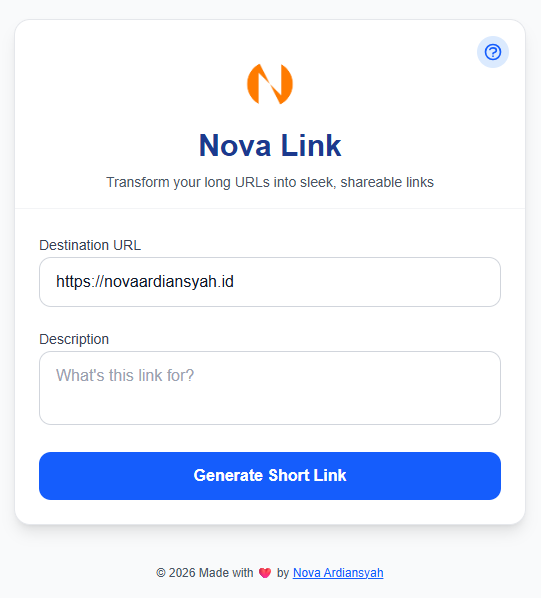
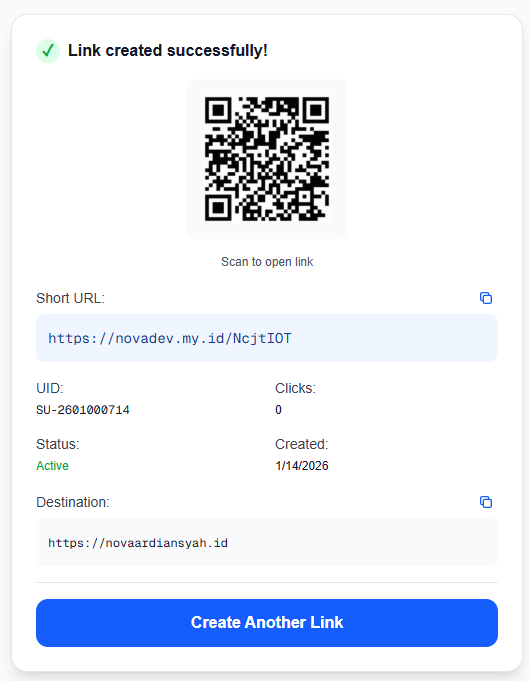
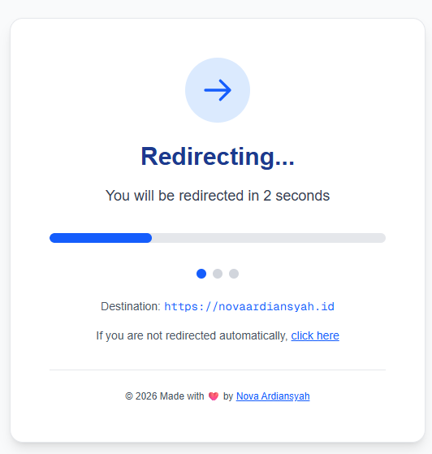
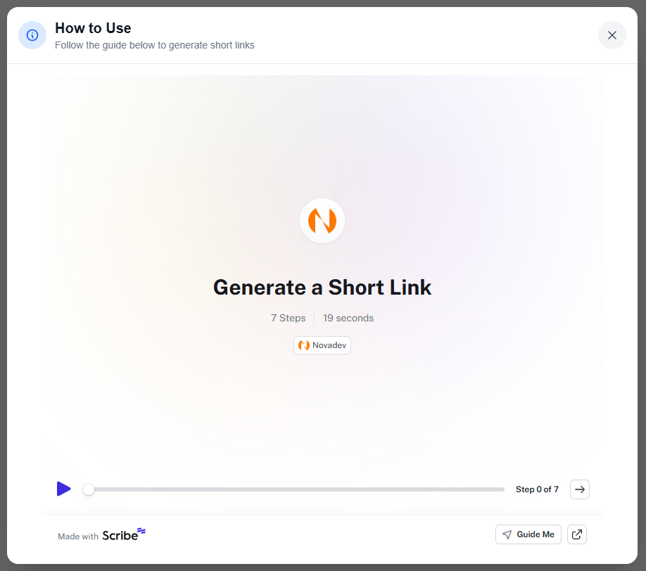

# Nova Link - Personal URL Shortener

Hi Future Developer,

Welcome to **Nova Link**! A modern personal URL shortener service built with the latest Next.js 15. This project provides a clean, modern interface for transforming long URLs into sleek, shareable links, complete with QR code generation and redirection analytics.

This repository is designed for personal utility management, making it easy to create and manage short links with a premium user experience **all without requiring any login.** It's ideal for learning about modern Next.js development or as a lightweight URL shortening tool for personal use.

## Dazzling Tech Stack

- [Next.js 15](https://nextjs.org/) - React Framework with App Router
- [TypeScript](https://www.typescriptlang.org/) - Type-safe JavaScript
- [Tailwind CSS](https://tailwindcss.com/) - Utility-first CSS framework
- [Lucide React](https://lucide.dev/) - Beautifully simple icons
- [React QR Code](https://www.npmjs.com/package/react-qr-code) - QR Code generator

## Live Preview
You can explore the production version here: [https://novadev.my.id](https://novadev.my.id)

> Note: This is an active production environment. If you encounter any bugs or have suggestions, please feel free to [open an issue](https://github.com/novaardiansyah/novadev/issues).

## Features Overview

This project features a **premium glassmorphism design** and intuitive user flow. Below are the key components of the application:

### 1. Simple & Intuitive Interface

The main page allows you to easily paste your long URLs and add optional notes for better management **no account or login required.**

### 2. Instant Short Link & QR Code

Once generated, you'll receive a sleek short link along with an automatically generated QR code for easy mobile sharing.

### 3. Smooth Redirection Experience

Every link leads to a professional redirection page featuring a countdown timer and a clean visual interface.

### 4. Integrated User Guide

New users can quickly learn how to use the service via the built-in "How to Use" guide, accessible right from the header.

## Project Status

## Let's Connect

Need to chat? Feel free to drop me a line via [Email](mailto:novaardiansyah78@gmail.com) or hit me up on [WhatsApp](https://wa.me/6289506668480?text=Hi%20Nova,%20I%20have%20a%20question%20about%20your%20project%20on%20GitHub:%20https://github.com/novaardiansyah/novadev). I'm just a message away, ready to groove with you!

## Code of Conduct

We believe in fostering a welcoming and inclusive environment for everyone. Please be respectful, considerate, and constructive in all interactions. By participating in this project, you agree to uphold our [Code of Conduct](CODE_OF_CONDUCT.md). Let's collaborate and make this community awesome together!

## Licensing Groove

This project is grooving to the rhythm of the [MIT License](LICENSE). Feel free to use, modify, and share it with the world. Just remember to keep the original license intact. Let's spread the joy of coding together!

---

**Happy coding and collaborating!**
— Nova Ardiansyah
